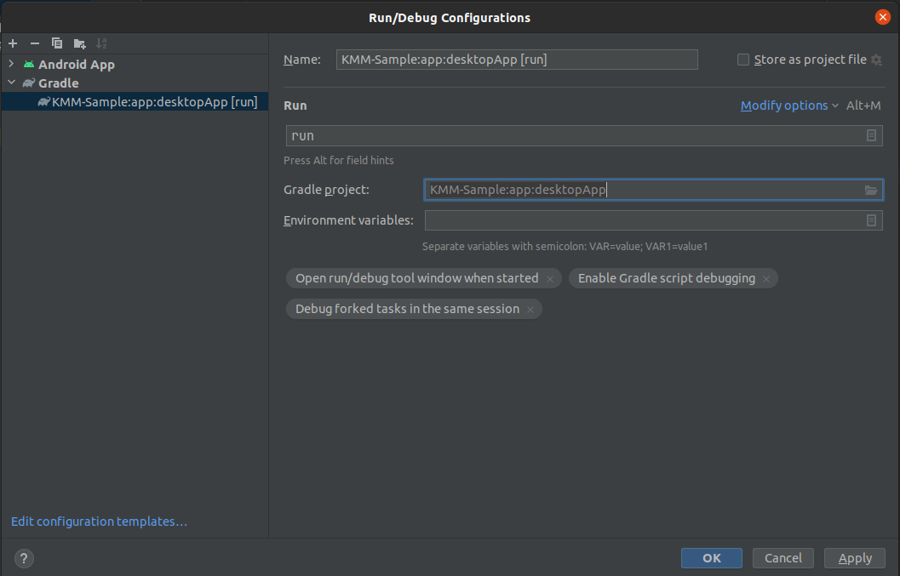

# KMM-Sample
Sample Kotlin Multiplateform Mobile project for Android and Desktop with C++ integration for both platforms

# Add desktop configuration in Android Studio

# Remarks
iOS is not supported yet